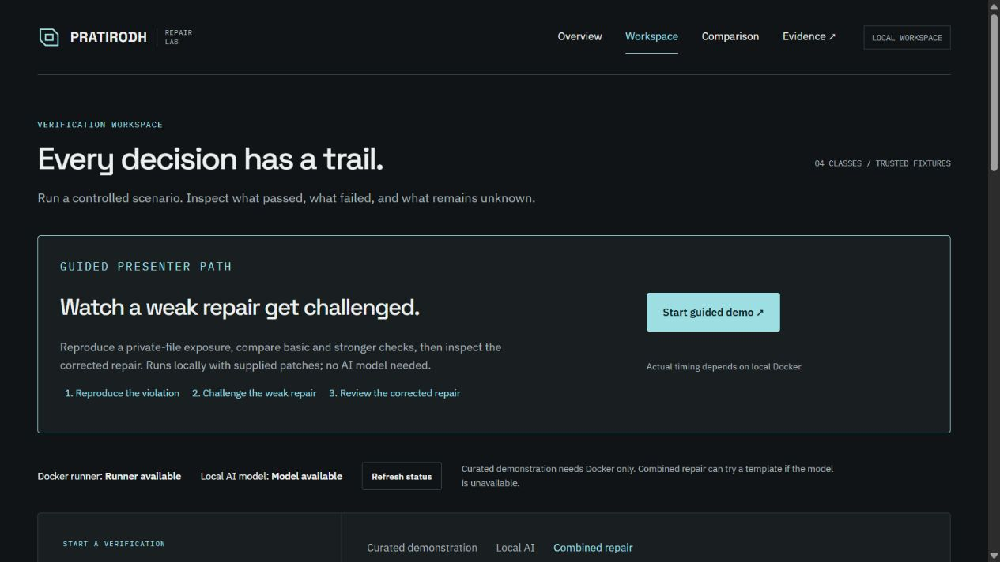

<div align="center">

# PRATIRODH

### Detect a vulnerability. Challenge the repair. Review the evidence.

**A Derby University hackathon project · Local AI · Human review · MIT licensed**

[Quick start](#setup-on-windows-macos-and-linux) · [Tech stack](#tech-stack) · [Project structure](#project-structure) · [Evaluation](#evaluation-and-results) · [License](LICENSE)

</div>

---

PRATIRODH is a security repair lab that proposes fixes and checks whether they preserve legitimate behavior while addressing a reproduced vulnerability. Each run produces signed evidence showing what passed, what failed and what remains unknown.

**Start with the guided demo:** it works with supplied patches and Docker, without an AI model. Add local Ollama when you want to generate repairs.



## What it does

- **Detect and reproduce:** identify candidate findings and confirm a declared security violation in a controlled fixture.
- **Propose repairs:** use supplied patches, deterministic templates, or a local Ollama model.
- **Challenge every candidate:** check legitimate requests, security requests and deliberately weakened copies of the repair.
- **Keep an evidence trail:** retain failed attempts, request observations, candidate origins, signatures and freshness checks.
- **Support human review:** explain the verdict and next action; approval is recorded separately from source application.
- **Compare measured outcomes:** inspect repair and verification results in a read-only comparison view.

```text
Detect → Reproduce → Propose → Verify → Challenge → Sign evidence → Human review
```

Supported repair classes: **CWE-22** (path traversal), **CWE-89** (SQL injection), **CWE-78** (command injection) and **CWE-798** (hardcoded credentials). Other detected classes remain detection-only.

This hackathon prototype operates on trusted, registered, single-file Flask fixtures. Readiness covers the recorded checks; source files are never replaced automatically.

## Tech stack

- **Backend:** Python 3.11, Flask, Jinja2 templates and Waitress.
- **Frontend:** HTML, CSS, JavaScript, GSAP animation and Three.js for the showcase visual. Fonts and browser assets are bundled locally.
- **Frontend build:** Node.js/npm and esbuild. Prebuilt assets are included, so Node.js is optional for running the demo.
- **Local AI:** Ollama with `qwen2.5-coder:3b`, accessed through a restricted loopback provider.
- **Detection:** Bandit and custom Python AST checks.
- **Verification:** contract-based requests, mutation challenges and generated security requests inside isolated Docker containers.
- **Evidence:** JSON records, SHA256 input bindings and Ed25519 signatures using `cryptography`.
- **Testing and review deployment:** pytest, Node's test runner, GitHub Actions and Docker Compose.

## Project structure

```text
Pratirodh/
├── pratirodh/                 # Active application and repair workflow
│   ├── cli.py                 # Commands for generation, verification and replay
│   ├── web.py                 # Workspace, jobs, evidence and comparison routes
│   ├── engine.py              # Independent candidate-verification gate
│   ├── candidates.py          # Common template/model generation interface
│   ├── repair_templates.py    # Supported deterministic repair templates
│   ├── provider.py            # Model adapters and restricted local transport
│   ├── evidence.py            # Signing, integrity and freshness checks
│   ├── execution.py           # Docker execution and workflow budgets
│   ├── comparison.py          # Evaluation scheduling and result aggregation
│   ├── templates/             # Server-rendered interface pages
│   └── static/                # CSS, fonts, licenses and built JavaScript
├── frontend/                  # JavaScript source, build script and browser tests
├── benchmark/
│   ├── scenarios/             # Disclosed development/regression fixtures
│   ├── external-v1/           # Public-source reproductions and frozen manifest
│   └── audit-v1/              # Final audit inputs, excluded from worker mounts
├── patch/                     # Retained patch-matching regression helper
├── tests/                     # Unit, security and Docker integration tests
├── tools/                     # Demo preparation, audit and baseline utilities
├── deploy/                    # Local deployment helpers
├── docs/                      # Guides, one workspace preview and recorded results
├── run_output/                # Local generated evidence; ignored by Git
├── requirements-deploy.txt    # Pinned active application dependencies
├── package.json               # Frontend dependencies and build/test commands
├── Dockerfile                 # Read-only review dashboard image
├── compose.yaml               # Authenticated local review deployment
└── LICENSE                    # MIT license for project-owned code
```

The repository includes the active product, evaluation fixtures and supporting tests. The small `patch/` module is retained for an existing patch-matching regression test. `run_output/` is created locally; signing material and private run data are not published.

## Setup on Windows, macOS and Linux

Install Git, Python 3.11 (the measured environment used 3.11.9) and Docker. On Windows use [Docker Desktop](https://docs.docker.com/desktop/setup/install/windows-install/) with Linux containers; on macOS use the [installer matching your Mac](https://docs.docker.com/desktop/setup/install/mac-install/). On Linux use [Docker Engine](https://docs.docker.com/engine/install/) or Docker Desktop. Start Docker and confirm `docker info` succeeds with your user account.

```sh
git clone https://github.com/armaan-1207/Pratirodh.git
cd Pratirodh
```

### Windows : PowerShell

```powershell
py -3.11 -m venv .venv
./.venv/Scripts/python.exe -m pip install -r requirements-deploy.txt
./.venv/Scripts/python.exe -m pratirodh build-runner
./.venv/Scripts/python.exe -m pratirodh serve --port 8765
```

These commands use the virtual environment directly, so PowerShell activation-policy changes are unnecessary. The optional `./start-demo.ps1` helper starts the existing Windows demo setup. If Windows requests firewall access, the demo only needs local access.

### macOS and Linux : Terminal

```sh
python3 -m venv .venv
./.venv/bin/python -m pip install -r requirements-deploy.txt
./.venv/bin/python -m pratirodh build-runner
./.venv/bin/python -m pratirodh serve --port 8765
```

Use a Python 3.11 interpreter for the virtual environment. Some Linux distributions require their `python3-venv` package. Docker must be running and accessible to your account. Windows has been exercised locally; the macOS/Linux commands describe the portable Python/Docker workflow and have not been separately validated on those hosts.

### Open and use the demo

Open [the workspace](http://127.0.0.1:8765/workspace) and select **Start guided demo**. It runs the supplied example through basic checks, stronger verification and a corrected repair. Follow the recorded stages, open each signed result, inspect failing requests and replay a request. The result summary explains the next action. Current evidence appears first; enable **Include stale evidence** to inspect retained older runs.

The workspace offers three modes:

- **Curated demonstration:** supplied examples; no model installation or model calls required.
- **Local AI:** local Ollama proposes up to two repairs, each independently verified.
- **Combined repair:** one template first, then up to two local Ollama attempts if readiness is not established. The complete repair workflow has a ten-minute limit.

Combined repair is the default workspace tab. Candidate history retains every rejection. `/comparison` provides separate Repair and Verification tabs with recorded outcomes, costs and expandable raw evidence. Stop the server with Ctrl+C. Source files are never replaced automatically.

### Optional local AI : all three platforms

Install [Ollama](https://docs.ollama.com/quickstart) for your OS and download the configured model while online:

```sh
ollama pull qwen2.5-coder:3b
ollama list
```

Keep the Ollama application/service running at `127.0.0.1:11434`. On Linux, follow [Ollama's installation instructions](https://docs.ollama.com/linux); run `ollama serve` if the service is not already running. Windows users can also use `./setup-offline.ps1`. No cloud API key is required. Local and combined modes use the restricted loopback provider and never invoke a cloud fallback. Missing models and provider timeouts leave unresolved evidence.

Run `python -m pratirodh doctor` with your virtual-environment interpreter to check the runner and local model. It may report incomplete setup when Ollama is missing; the curated demo still works without Ollama. If Docker or the runner is unavailable, start Docker and repeat `build-runner`. If the model is unavailable, check `ollama list` and the local service. If port 8765 is occupied, use `serve --port 8767` and open that port. After relevant source changes, regenerate presentation evidence with the virtual-environment interpreter and `tools/prepare_demo.py`; old evidence remains stale by design.

The CLI examples below use `python` as shorthand for the virtual-environment interpreter: `./.venv/Scripts/python.exe` on Windows, `./.venv/bin/python` on macOS/Linux. Node.js is only needed to rebuild the frontend; prebuilt local assets are included.

## Generate, verify and replay

```powershell
python -m pratirodh pipeline benchmark/scenarios/cwe-22-development-01 --contract benchmark/scenarios/cwe-22-development-01/contract.json --strategy combined
python -m pratirodh verify-patch benchmark/scenarios/cwe-22-development-01 --contract benchmark/scenarios/cwe-22-development-01/contract.json --patch benchmark/scenarios/cwe-22-development-01/patches/correct.diff
python -m pratirodh replay RUN_ID --case legitimate
python -m pratirodh verify-evidence RUN_ID
python -m pratirodh review RUN_ID --action approve --reviewer "Local reviewer" --rationale "Reviewed current evidence"
```

The pipeline supports `--strategy combined|ollama|template`. Its CLI default remains `ollama` for compatibility. A required failure returns `REJECT`; missing observations or unqualified checks return `INSUFFICIENT_EVIDENCE`; passing the required checks returns `READY_FOR_REVIEW`. Readiness applies only to the run's bounded scope. Approval and replay require current evidence.

Templates generate diffs in memory from an exact, unambiguous source match. They use the same patch policy and independent gate as model repairs. Supported repair classes are CWE-22, CWE-89, CWE-78 and CWE-798. Other detected classes remain detection-only. The supported targets are trusted, registered, single-file Flask fixtures.

## Evaluation and results

**To use the demo, you do not need the historical source archive or the benchmark setup.** Open the workspace and run a supplied example.

For the recorded comparison, open `/comparison` or read [the comparison report](docs/COMPARISON.md). The [full JSON results](docs/COMPARISON_RESULTS_V1.json) retain successful and unsuccessful attempts.

The cohorts are disclosed separately:

- **Development/regression:** 36 already-inspected synthetic scenarios and 144 supplied patches. See [curated results](docs/BENCHMARK_RESULTS.json).
- **External reproductions:** seven cases adapted from public advisories and upstream fixes, including four evaluation cases and three development cases. These are minimal Flask reproductions, not tests of entire upstream applications. The target was sixteen; the nine-case shortfall is documented in [the case manifest](benchmark/external-v1/manifest.json).

The comparison asks two questions: **does the verifier judge identical patches correctly?** and **does each workflow produce a working repair?** Repair workflows run three times per evaluation case. The final audit separately checks whether generated repairs actually work.

Results describe this small, team-authored evaluation. Repeated attempts are grouped by scenario for uncertainty estimates. Human-review referrals remain separate from positive decisions and no market-wide superiority is claimed.

### Rerunning the historical comparison

The published repository includes the harness and recorded results, but **does not include the older baseline source**. A fresh comparison against that baseline requires a separately supplied, exact source archive. Without it, you can still run PRATIRODH and review the existing results.

<details>
<summary><strong>Advanced reproduction commands and archive requirements</strong></summary>

Use your virtual-environment interpreter in place of `python` and replace the archive path with your own local path:

```sh
python tools/build_baseline.py --archive /path/to/historical-edffe24.tar
python -m pratirodh compare --prepare
python -m pratirodh compare --hours 12 --output run_output/reproduced-comparison-v1.json
```

The archive must be the original `git archive edffe24` tar. Its required SHA256 is:

```text
a64f6a440083aecc0e770ca5be1df0f9aec391ce33267273e8459cf2e83097b1
```

The builder checks this hash before building the disposable historical Docker image. Historical dependencies stay inside that image. The baseline revision is `edffe24`; the earlier PRATIRODH revision is `8f57db6`. Neither revision is included in this release's Git history.

Runs rotate across cases and systems, permit one concurrent model request and checkpoint results. Each repair allows two model calls at most, 180 seconds per generation and ten minutes total. The full comparison has a twelve-hour cap with a final reserve for auditing generated candidates.

The final audit is checked against vulnerable originals and known repairs before measurement. It runs in a separate supervisor process; its requests and assertions are absent from generator prompts and repair feedback. Generation workers do not receive the audit directory. These controls assume a trusted operator controlling the host.

Native `AUTO_MERGE`, `HUMAN_REVIEW` and `REJECT` labels are retained. A referral for human review is not counted as an approved repair.

Add `--resume` to continue an interrupted comparison within its original cap. Changed cohort or implementation hashes prevent resumption; changed implementations require a new versioned evaluation. See [the methodology](docs/COMPARISON.md) and [baseline inventory](docs/HISTORICAL_BASELINE.json) for details.

</details>

## Checks and deployment

```powershell
python -m pip install pytest==8.1.1
$env:PRATIRODH_DOCKER_TESTS = '1'
python -m pytest -q
npm ci
npm run build
npm test
python -m bandit -r pratirodh -ll
```

On macOS/Linux, use `PRATIRODH_DOCKER_TESTS=1 python -m pytest -q` instead of the PowerShell environment assignment.

Use the pinned `requirements-deploy.txt` for the active application. Historical dependencies must not be installed into that environment.

The dashboard includes authentication, CSRF protection, host restrictions, escaped evidence, signed inventories and freshness checks. Container execution has no network access and uses read-only mounts. Deployment can be configured for authenticated read-only evidence review; it has no target execution privileges or signing key.

```powershell
./deploy/init-secrets.ps1
python tools/export_review.py
docker compose up -d --build
```

Keep `.env`, signing keys, local databases and generated private evidence out of Git. The repository includes synthetic fixture credentials only. Review the exact staged files before publishing.


## Documentation

- [Project guide](docs/PROJECT_GUIDE.md) : implementation and operation.
- [Demo narration](docs/DEMO.md) : a presenter walkthrough.
- [Comparison report](docs/COMPARISON.md) : measured outcomes and limitations.
- [Interface attribution](docs/INTERFACE_SOURCES.md) : third-party assets and licenses.
- [Security policy](SECURITY.md) : security boundaries and reporting.

## License and hackathon scope

PRATIRODH is released under the [MIT License](LICENSE). This repository was built for the Derby University hackathon to demonstrate bounded security repair and evidence review. It is a prototype, not a certification service or an automatic production patching tool.

Third-party packages and adapted public fixtures retain their own licenses and attribution. See the [external case manifest](benchmark/external-v1/manifest.json) and [interface attribution](docs/INTERFACE_SOURCES.md); the project license does not replace those terms.
