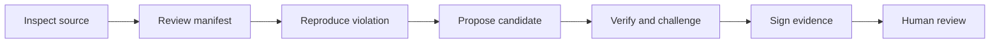

<div align="center">

# PRATIRODH

### Detect a vulnerability. Challenge the repair. Review the evidence.

A security repair lab built for the **Derby University Hackathon**.

[Functional verification — 7 October 2026](docs/FUNCTIONAL_RELEASE_20261007.md)
records 263 passing Python/Docker tests, the verified local model repair and the
remaining upstream/cloud qualification limits.


[](LICENSE)

[Quick start](#quick-start) · [Features](#features) · [Architecture](#architecture) · [Tech stack](#tech-stack) · [Folder structure](#folder-structure) · [Results](#results-and-current-status) · [Future scope](#future-scope)

</div>

PRATIRODH investigates declared security violations, proposes or accepts candidate repairs, and checks whether they preserve legitimate behavior. It challenges repairs with deliberately weakened variants and retains signed evidence for human review.

**Start with the multi-file synthetic demo:** Python, JavaScript and C/C++ examples run in restricted Docker workers with supplied patches. No AI model is required for these examples. Optional project AI uses **Qwen2.5-Coder 7B** through a reviewed model configuration.


Actual results appear in signed evidence pages in the local interface.

## Features

- **Project intake:** inventory source files and propose manifests for Python/pytest, locked npm and CMake/CTest layouts. Operators review commands, protected inputs, dependencies and security properties before execution.
- **Repair and discovery workflows:** reproduce a declared violation, retain failed candidates, and verify supplied or locally generated multi-file patches.
- **Challenge the repair:** run regression, control, reproducer and variation checks; qualify weakened repairs and test whether the checks catch them.
- **Requests redirect repair:** pinned upstream source for CVE-2018-18074, legitimate redirect controls, downgrade and port-change checks, and a deliberately weakened repair. Supplied-patch, zero-model-call verification remains separate from upstream qualification. [Preparation and scope](docs/REQUESTS_DEMO.md).
- **Restricted workers:** use bounded Docker execution without external networking, controller mounts, signing keys or a mounted Docker socket.
- **Signed evidence:** bind source and execution inputs, sign artifact inventories with Ed25519, display freshness, and export verifiable bundles.
- **Review interface:** inspect jobs, candidate diffs, check observations, comparison records and upstream campaign status. Source files are never replaced automatically.
- **Interactive showcase:** a full-width Three.js verification landscape, GSAP scroll storytelling, expandable workflow steps, and keyboard-accessible example tabs. [Design references and licenses](docs/FRONTEND_DESIGN.md).

Project discovery, repair checks, and signed review records are available for the supported language workflows. See the evaluation documentation for tested coverage and acceptance criteria.

## Architecture



The controller holds reviewed manifests, generation budgets and signing material. Execution workers receive approved source snapshots and commands. The upstream campaign uses a separate final-audit worker whose protected assertions stay outside model-visible source. A readiness decision applies to the tested scope and still requires human review.

<details>
<summary><strong>Current signed project evidence</strong></summary>


This synthetic C++ result verifies a supplied candidate with **zero model calls**. It demonstrates the evidence workflow; it does not measure model accuracy or complete the separate upstream audit.

</details>

## Quick start

### Prerequisites

- **Git and Python 3.11.** The local verification environment used Python 3.11.9.
- **Docker with Linux containers**, running and accessible to your account. Check with `docker info`.
- **Ollama is optional** for model-generated repairs. Supplied-patch demos work without it.
- **Node.js/npm is optional** for frontend development. Browser assets and fonts are already bundled.

Clone the current `main` branch:

```sh
git clone https://github.com/armaan-1207/Pratirodh.git
cd Pratirodh
```

### Windows (PowerShell)

```powershell
py -3.11 -m venv .venv
./.venv/Scripts/python.exe -m pip install -r requirements-deploy.txt
./.venv/Scripts/python.exe scripts/start_demo.py --port 8767
```

### macOS and Linux (Terminal)

```sh
python3 -m venv .venv
./.venv/bin/python -m pip install -r requirements-deploy.txt
./.venv/bin/python scripts/start_demo.py --port 8767
```

Use a Python 3.11 interpreter. Some Linux distributions need `python3-venv`. Windows has been exercised locally; macOS/Linux commands describe the portable workflow and have not been separately tested on those hosts.

The helper builds the project worker image if missing, executes the synthetic examples, verifies their signed records, and starts the dashboard. The initial worker build needs access to package repositories. Subsequent target execution has no external network. Keep the terminal open; Ctrl+C stops the dashboard and preserves the evidence.

### Explore the application

The dashboard at [localhost:8767](http://127.0.0.1:8767/) provides these views:

- **`/projects`:** inspect a project or run a synthetic Python, JavaScript or C/C++ demonstration.
- **`/walkthrough`:** select a saved signed result, inspect its checks and download its evidence.
- **`/workspace`:** guided Flask fixtures, execution jobs and evidence history.
- **`/comparison`:** recorded repair and verification experiments.
- **`/validation`:** upstream acquisition, qualification, worker attestations and audit progress.

To reopen an existing evidence store without recomputing examples, use your virtual-environment interpreter:

```sh
python scripts/start_demo.py --port 8767 --store PATH_TO_EVIDENCE_STORE
```

If the port is occupied, select another `--port`. If Docker is unavailable, start it and check `docker info`. Models are not needed to repair this setup error. Local evidence is ignored by Git; a fresh clone does not include the operator's private records or acquired source archives.

<details>
<summary><strong>Mobile project intake</strong></summary>


The navigation wraps on narrow screens. Project inputs, long source names and worker digests stay within the page width.

</details>

## Model setup

### Project workflows: Qwen2.5-Coder 7B

The default `laptop` profile uses **`qwen2.5-coder:7b`**, an 8,192-token context and at least 8 GiB of declared available memory. The prepared Azure model/controller passed preflight with this model in **Q4_K_M** quantization.

Install [Ollama](https://docs.ollama.com/quickstart), then prepare weights while online:

```sh
ollama pull qwen2.5-coder:7b
ollama list
```

Keep the Ollama service at `127.0.0.1:11434`. Pulling weights alone does not authorize a project run: its reviewed manifest must pin model/runtime digests, quantization, memory, dependencies and worker image. Imported projects require a dedicated worker. See [project workflows](docs/PROJECT_WORKFLOWS.md) and [cloud workers](docs/CLOUD_WORKERS.md).

On Azure, the model client runs on the Linux controller against its local Ollama service. Execution and final audit use distinct workers. The recorded model preflight establishes infrastructure preparation; upstream repair accuracy remains unmeasured.

<details>
<summary><strong>Earlier Flask workflow and historical results: Qwen 3B</strong></summary>

The guided Flask browser provider and `setup-offline.ps1` helper still default to `qwen2.5-coder:3b`. The historical comparison also used this model. Those results retain their original model labels.

```sh
ollama pull qwen2.5-coder:3b
python -m pratirodh build-runner
python -m pratirodh serve --port 8765
```

Use your virtual-environment interpreter. The Workspace includes guided supplied-patch verification without model calls. Optional AI and combined modes use the guided provider's 3B default unless `PRATIRODH_LOCAL_MODEL` selects another installed local model. The launcher accepts `--model qwen2.5-coder:7b`, which applies the same choice to availability checks and generation. The single-file CLI accepts `--model`; project workflows configure models separately through reviewed manifests.

The guided fixtures cover CWE-22, CWE-89, CWE-78 and CWE-798. The `prototype-small` 3B project profile is experimental and does not satisfy the planned default-model release evaluation. Missing models and timeouts retain unresolved evidence; these local workflows invoke no cloud fallback.

</details>

## Tech stack

### Application and interface

- **Python 3.11, Flask, Jinja2 and Waitress:** CLI, backend, templates and serving.
- **HTML, CSS and JavaScript:** workspace, jobs, evidence and comparison views.
- **GSAP / ScrollTrigger and Three.js:** masked headline reveals, scroll-linked evidence panels, animated example tabs, and the illustrative verification landscape with a ThreeUI particle field. Pause, reduced-motion and unavailable-WebGL fallbacks are built in.
- **Node.js, npm and esbuild:** frontend builds; local Outfit, Space Grotesk and IBM Plex fonts and prebuilt assets are included.

### Repair, workers and evidence

- **Ollama / llama.cpp adapters:** local generation with explicit model identity and budgets.
- **Bandit and Python AST checks:** finding detection in supported inputs.
- **Docker, pytest, npm and CMake/CTest:** reviewed Python, JavaScript and C/C++ execution layouts.
- **Contract observations and mutation challenges:** legitimate behavior, reproduced violations and weakened-candidate checks.
- **SHA-256, Ed25519 and cryptography:** input bindings, signed inventories and integrity verification.
- **Docker Compose and Azure tooling:** read-only review deployment and separate campaign workers.
- **pytest, Node test runner and GitHub Actions:** automated verification.

Pinned application packages: [requirements-deploy.txt](requirements-deploy.txt). Frontend packages: [package.json](package.json) and [package-lock.json](package-lock.json).

## Folder structure

```text
Pratirodh/
├── .github/workflows/          # Release checks
├── pratirodh/                  # Active Python application
│   ├── cli.py                  # Generation, verification and export commands
│   ├── web.py                  # Dashboard routes and jobs
│   ├── engine.py               # Guided Flask verification gate
│   ├── candidates.py           # Template/model candidate interface
│   ├── repair_templates.py     # Deterministic Flask repair templates
│   ├── provider.py             # Guided model adapters
│   ├── evidence.py             # Signing, integrity and freshness
│   ├── execution.py            # Guided Docker execution and budgets
│   ├── comparison.py           # Historical comparison harness
│   ├── upstream_status.py      # Artifact-derived campaign status
│   ├── projects/               # Experimental multi-file workflows
│   │   ├── manifest.py         # Intake and reviewed source inventory
│   │   ├── engine.py           # Discovery, repair and verification
│   │   ├── model.py            # Local model preflight and requests
│   │   ├── worker.py           # Docker execution controller
│   │   ├── worker_entry.py     # Restricted worker supervisor
│   │   ├── evaluation.py       # Campaign scheduling and final audit
│   │   └── export.py           # Signed evidence bundles
│   ├── templates/              # Server-rendered pages
│   └── static/                 # CSS, fonts, licenses and built JS
├── frontend/                   # Browser source, build script and tests
├── benchmark/
│   ├── scenarios/              # Synthetic Flask fixtures
│   ├── external-v1/            # Public-advisory reproductions
│   ├── audit-v1/               # Protected historical audit inputs
│   └── upstream-v1/            # Frozen 24-case intake manifest
├── scripts/                    # Synthetic demo and local worker helpers
├── tools/                      # Acquisition, campaign and audit utilities
├── deploy/                     # Review deployment and Azure preparation
├── docs/                       # Guides, screenshots and recorded results
├── tests/                      # Application and Docker integration checks
├── patch/                      # Retained patch-matching regression helper
├── run_output/                 # Local evidence and operator data; ignored
├── requirements-deploy.txt     # Pinned application dependencies
├── pyproject.toml              # Python packaging and CLI metadata
├── package.json                # Frontend build/test commands
├── Dockerfile                  # Read-only review dashboard
├── compose.yaml                # Authenticated local review service
└── LICENSE                     # MIT license for project-owned code
```

## Results and current status

**Local reconciliation on 7 October 2026:** the main controller is combined with the latest continuous frontend animation, supplied-patch demonstrations, cloud guard/accounting tools and preserved upstream preparation inputs. Authentication, security headers, freshness checks, signed exports and qualification requirements remain enforced. [Reconciliation and scope](docs/RECONCILIATION.md).

**Verified locally on 7 October 2026:** all 254 Python tests passed with Docker enabled and no skips; all 3 frontend tests passed. Bundled assets rebuilt successfully, controller Python and frontend npm dependency audits found no known vulnerabilities, static security checks passed, and the deployment image and wheel passed inspection. Clean exported-checkout preparation retained the pinned Requests demo and reported unsupported full-upstream inputs explicitly. These results cover local integration, not Azure qualification or complete image vulnerability coverage.

**OWASP review and remediation - 7 October 2026:** all ten OWASP 2025 categories were reviewed in the documented local/code scope. Source secret rejection, redirect blocking, bounded export verification, sanitized security events and main protection have executable checks. Images use pinned build inputs and updated application/tool dependencies. Unfixed OS advisories remain dated, reviewed residual risks; this is not certification or a claim of complete security. [Historical assessment](docs/OWASP_ASSESSMENT_20261007.md) · [Fixes, verification and remaining risks](docs/SECURITY_REMEDIATION_20261007.md).

**Upstream preparation:** strict local intake produced 5 prepared snapshots and 19 explicit blockers. Older 24/24 static readiness observations used different intake limits and reduced checkouts. Prepared snapshots are not runtime qualifications. The larger campaign and independent audit remain incomplete. [Portable preparation](docs/UPSTREAM_PREPARATION.md).

**Historical verification on 2 October 2026:** 124 Python tests passed with Docker tests enabled, and all 3 frontend tests passed. The frontend rebuild matched tracked assets; the package wheel included the project worker Dockerfile. Bandit reported no medium/high findings and the production npm dependency audit reported no vulnerabilities.

Localhost browser checks completed the guided Flask demo and all three language repair demos. Each project demo rejected the incomplete repair and produced a corrected repair ready for review. Signed exports verified against the retained store public key. These synthetic supplied-candidate runs made **zero model calls**.

### Upstream campaign

The upstream validation workflow covers source provenance, comparison execution, and independent auditing.

<details>
<summary><strong>Campaign preparation and technical status</strong></summary>

**Recorded preparation: 24 source revisions acquired · 0 qualified cases · 0 completed attempts · 0 audits.** The recorded campaign remains `BLOCKED_INTAKE`. The Azure workers were deallocated after preflight. Acquisition and infrastructure preparation do not establish a working upstream repair.

The UI derives counts from acquisition, campaign and worker artifacts and exposes them at `/validation/status.json`. Accepted campaign results require a verified signed snapshot and passing audit evidence. A fresh clone displays only the records available locally.

<details>
<summary><strong>Recorded upstream preparation</strong></summary>


The Validation page separates dated local checks, preparation and current signed runtime qualification. Preparation is not a completed experiment.

</details>

</details>

### Earlier recorded evaluations

- **Synthetic regression suite:** 36 disclosed scenarios and 144 supplied patches. [Recorded results](docs/BENCHMARK_RESULTS.json).
- **External reproductions:** seven minimal Flask adaptations from public advisories; four evaluation cases and three development cases. Nine cases short of the original sixteen-case target. [Provenance](benchmark/external-v1/manifest.json).
- **Historical comparison:** repeated repair experiments and identical-patch verification using Qwen 3B, with retained failures and unresolved outcomes. [Method and results](docs/COMPARISON.md) · [Raw JSON](docs/COMPARISON_RESULTS_V1.json).

These are different cohorts. The earlier results do not substitute for the 24-case upstream campaign or establish market-wide superiority.

### Rerunning the historical comparison

The public release excludes the older baseline source. Advanced reproduction requires the exact `git archive edffe24` tar with SHA-256 `a64f6a440083aecc0e770ca5be1df0f9aec391ce33267273e8459cf2e83097b1`.

```sh
python tools/build_baseline.py --archive /path/to/historical-edffe24.tar
python -m pratirodh compare --prepare
python -m pratirodh compare --hours 12 --output run_output/reproduced-comparison-v1.json
```

Historical dependencies stay inside the disposable baseline image. See [the methodology](docs/COMPARISON.md) and [baseline inventory](docs/HISTORICAL_BASELINE.json) before reproduction. The demo and recorded result review do not require this archive.

## Evidence export

Use your virtual-environment interpreter and the store path printed by the demo helper:

```sh
python -m pratirodh export RUN_ID --store PATH_TO_EVIDENCE_STORE --output evidence.zip
python -m pratirodh verify-bundle evidence.zip --trust PATH_TO_TRUST_PUBLIC_KEY
```

Preserve the store's `trust.pub` independently from the downloaded ZIP. Bundles contain signed artifacts and public trust material; they exclude the private signing key. Signatures establish integrity, while correctness depends on the recorded checks and their scope.

## Development and checks

From the configured virtual environment:

```powershell
python -m pip install pytest==8.1.1
python -m pratirodh build-runner
python -m pratirodh project build-worker
$env:PRATIRODH_DOCKER_TESTS = '1'
python -m pytest -q
npm ci
npm run build
npm test
python -m bandit -r pratirodh -ll
```

On macOS/Linux, replace the PowerShell assignment with `PRATIRODH_DOCKER_TESTS=1 python -m pytest -q`. Node.js/npm is needed for frontend development only. Use the active requirements file; do not install historical baseline dependencies into this environment.

## Read-only review deployment

```powershell
./deploy/init-secrets.ps1
python tools/export_review.py
docker compose up -d --build
```

Compose binds `127.0.0.1:8766` and serves exported evidence without target execution privileges or a signing key. Production sessions require HTTPS; configure a local TLS reverse proxy for authenticated browser review. The application enforces authentication, CSRF and host restrictions. Target execution uses a separate worker boundary.

Keep `.env`, signing keys, local databases, model weights, acquired source archives and private evidence out of Git. Published screenshots contain synthetic or disclosed campaign data.

## Future scope

1. **Complete upstream qualification:** review licenses and reproduce vulnerable/fixed controls for all 24 cases; prepare pinned dependency images and reviewed security properties.
2. **Run and audit the campaign:** confirm the remaining cloud allowance, execute the scheduled comparison and independently audit retained candidates.
3. **Publish stronger measurements:** case-level correctness, uncertainty estimates, actual resource use and reproducible host/model/image identities.
4. **Broaden project support:** extend reviewed adapters and dependency preparation; investigate service-backed and multi-container applications.
5. **Improve property testing and operations:** qualify fuzz/HTTP harnesses, strengthen authorization checks, and simplify manifests, resumable runs and evidence handoff.

These are planned acceptance and development tasks. Review residual image risks and deployment controls before expanding to sensitive or unfamiliar inputs; upstream qualification and independent audit remain separate priorities.

## Documentation

- [Current team handover](docs/PROJECT_MASTER.md) · [Reconciliation inventory](docs/reconciliation-inventory.json).
- [Project workflows](docs/PROJECT_WORKFLOWS.md): manifests, worker boundaries, model profiles and budgets.
- [Demo readiness](docs/DEMO_READINESS.md): completed capabilities and outstanding acceptance gates.
- [Cloud workers](docs/CLOUD_WORKERS.md) · [Azure setup](deploy/AZURE_VALIDATION.md) · [Local Linux workers](docs/LINUX_WORKERS.md).
- [Guided Flask project guide](docs/PROJECT_GUIDE.md) · [Demo narration](docs/DEMO.md).
- [Historical comparison](docs/COMPARISON.md) · [Interface attribution](docs/INTERFACE_SOURCES.md).
- [Security policy](SECURITY.md) · [Third-party notices](docs/THIRD_PARTY_NOTICES.md).

## License

Project-owned code is released under the [MIT License](LICENSE). Third-party dependencies and adapted fixtures retain their own licenses and attribution. This hackathon prototype provides bounded repair evidence for human decisions.
